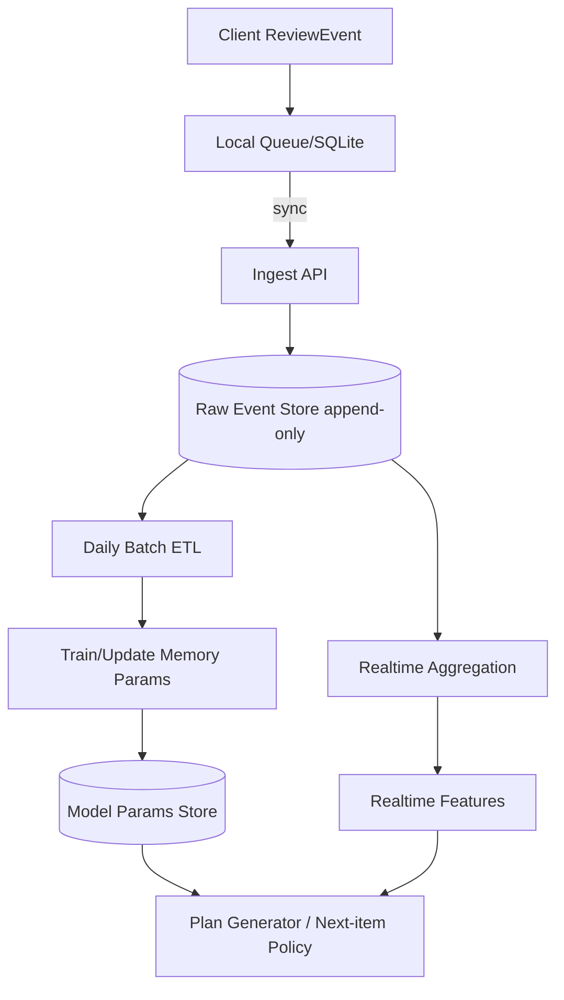
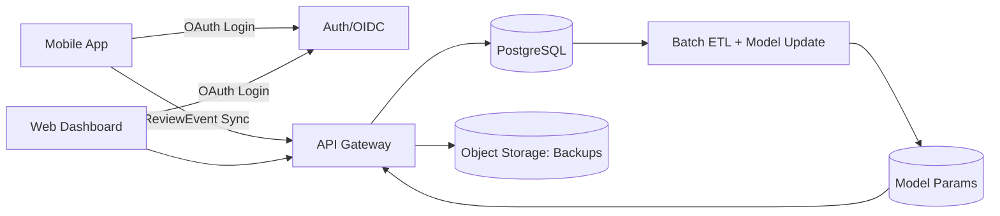
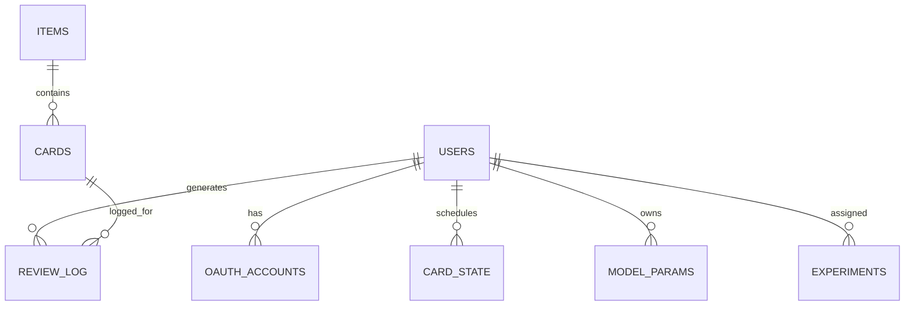
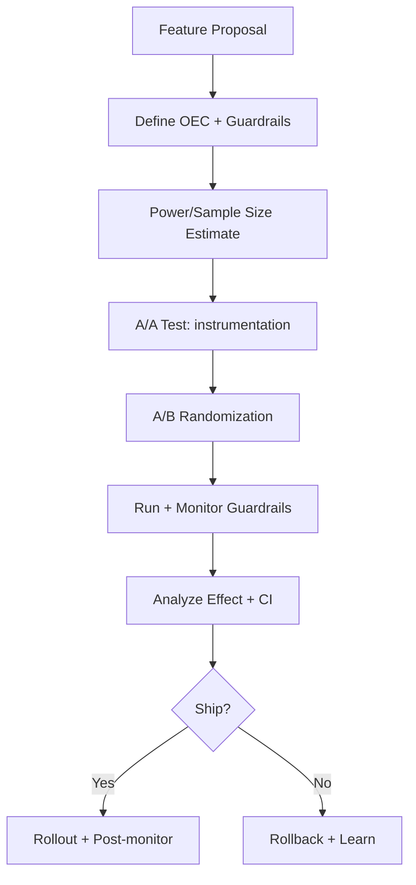

# 일본어 한자·단어 암기 취약 사용자를 위한 개인화 학습 앱 작업 지침서

## Executive Summary

본 문서는 “일본어 한자·단어 암기를 어려워하는 사용자”를 대상으로 하는 **개인화 학습 앱(모바일 중심 + 웹 보조)**의 **개발 전 기획 문서이자 구현 지침서(implementation playbook)**다. 목표는 “문제 더 풀기”가 아니라 **언제·무엇을·어떻게 복습할지(스케줄·문항 유형·학습량)**를 데이터 기반으로 정교화하여 **장기 유지(지연 인출 성과)**를 끌어올리는 것이다. 핵심 근거는 (우선순위 순) **간격 반복(spaced practice)**과 **인출 연습(retrieval practice)**이며, 이는 다수의 연구·메타분석에서 강한 재현성과 교육적 적용 가능성을 보인다. citeturn0search0turn0search13turn7search9

중요한 설계 원칙은 두 가지다.  
첫째, “학습 스타일(시각형/청각형)” 같은 자기보고 기반 분류는 **교육적 처방 근거가 약하므로** 개인화 축으로 채택하지 않는다. 대신 **행동 데이터(정확도, 반응시간 RT, 힌트 사용, 오류 유형, 연체 패턴)**로 “외우는 방식(전략 프로파일)”을 추정한다. citeturn0search6turn0search14  
둘째, MVP는 ‘AI 과잉’이 아니라 **계측 무결성·SRS·오프라인·동기화·보안(OAuth)**이라는 품질 기반을 먼저 고정한다. 네이티브 앱 OAuth는 외부 브라우저 기반 사용자 에이전트와 PKCE 적용이 권고된 BCP로 정리돼 있다. citeturn3search1turn3search2turn3search3

우선 가정(명시): 사용자 지역 **미지정**, 법적 준수 대상 국가는 **미지정**(따라서 GDPR·한국·일본 권고 포함), 초기 콘텐츠 소스는 **공개 라이선스 또는 자체 제작(미지정)**. 개인정보는 기본값을 “최소 수집·목적 제한·기본 비공개(privacy by default)”로 설계하며, GDPR의 원칙(Art.5)과 설계단계 보호(Art.25) 및 EDPB 가이드라인을 준거로 삼는다. citeturn4search0turn4search1turn4search2

본 문서의 출력물은 (a) 페르소나·진단·스키마·알고리즘·API·아키텍처·보안·실험·윤리까지 포함한 **실무형 체크리스트**, (b) Cursor에서 바로 실행할 수 있도록 쪼갠 **스프린트 기반 이슈(작업) 백로그**와 템플릿, (c) 샘플 백로그 CSV다.

우선 참고할 출처(우선순위)  
entity["people","Nicholas J. Cepeda","memory researcher"] 외, 간격 반복 메타분석 citeturn0search0  
entity["people","Henry L. Roediger III","psychologist wash u"] 외, 인출 연습(테스팅 효과) citeturn0search13turn0search5  
entity["people","Harold Pashler","cognitive scientist"] 외, 학습 스타일 ‘메싱’ 근거 부족 리뷰 citeturn0search6turn0search10  
OAuth 네이티브/PKCE/보안 BCP citeturn3search1turn3search2turn3search3  
GDPR 원칙/설계단계 보호 및 EDPB 가이드라인 citeturn4search0turn4search1turn4search2

## 목표 사용자 페르소나, 온보딩, 진단 테스트, 초기 설정값

### 지침 개요

**목표**: 페르소나를 “설명용 카드”가 아니라 **(1) 온보딩 질문 (2) 진단 문항 구성 (3) 초기 설정값**을 고정하는 **구현 단위**로 정의한다. 진단의 목적은 레벨테스트가 아니라 **전략 프로파일 초기값(외우는 방식)**과 **안전한 초깃값(부하/이탈 최소화)**을 설정하는 것이다.  

**책임자/역할**:  
- PM: 페르소나 정의, 온보딩 필수 질문 확정, KPI 승인  
- 학습과학 리드: 진단 문항 설계(인출 중심), 문항 난이도 통제  
- UX: 온보딩/진단 UX(8–12분 제한), 피로 최소화  
- 데이터: 진단 점수 산출/저장, 초기값 룰 구현

**입력**: 초기 콘텐츠 세트(미지정), 프롬프트 타입 정의(의미/읽기/표기/문맥), 시간 제약(8–12분).  
**출력**: 페르소나 표, 온보딩 폼 스펙, 진단 테스트 스펙(문항 예시 포함), 초기 설정값 룰.  

**절차/체크리스트(필수)**:  
1) 진단은 “재노출(정답 먼저 보기)”을 금지하고, **인출 시도 → 피드백** 흐름으로 고정한다(인출 연습 근거). citeturn0search13turn7search9  
2) 문항은 “한 문항에 모든 정보를 몰아넣지” 말고 세그먼트(단계적 공개)로 구성한다(인지부하 관리). citeturn0search3turn1search0  
3) 민감 데이터(음성 원본/필기 원본/생체)는 기본 비수집(옵트인 연구 모드만). citeturn4search1turn4search2  

**우선순위**: P0(반드시) = 진단 최소화·이탈 방지·초기값 자동 산출.  
**산출물 형식**: PRD 섹션 + UX 와이어 + 진단 문항 CSV/JSON(문항/정답/오류코드).  
**검증 방법**: 진단 완료율(목표 ≥ 85%), 평균 진단 시간(목표 10분 내), 진단 후 7일 유지(코호트) 변화.  
**리스크/대응**:  
- 리스크: 진단이 길면 이탈. 대응: 36문항 내, 강제 스킵 허용(단, 최소 24문항 확보).  
- 리스크: 자기보고 학습 스타일 질문 도입 유혹. 대응: 금지(근거 부족), 행동 지표로 대체. citeturn0search6  

### 페르소나 표(미지정 항목은 ‘미지정’)

| 페르소나 | 연령 | 학습목표 | 학습시간/일 | 배경지식 | 암기 실패 가설 | 온보딩 질문(필수) | 진단 초점 | 초기 설정값(디폴트) |
|---|---:|---|---:|---|---|---|---|---|
| 입문 재도전형 | 18–24 | JLPT N5–N4(미지정) | 10–15분 | 한자권 여부: 미지정 / 일본어 경험: 미지정 | 재노출 위주(“아는 느낌”)로 장기 유지 실패 | 목표/기간, 하루 가능 시간, 중단 이력, 알림 허용, 한자권 여부 | 회상형(입력) vs 인지형(선택) 격차 | 목표 유지율 0.85, 신규 6/일, 복습 상한 40, 회상 70%:인지 30%, 힌트 2단계 |
| 의미는 아는데 읽기 약함형 | 25–34 | 독해 N3(미지정) | 15–25분 | 의미 기억↑, 읽기/발음 불안(가설) | 표기↔음 매핑 취약으로 혼동↑ | 목표(독해/회화), 읽기 불안, 입력 방식(키보드/펜), 오프라인 빈도 | 읽기 오류 유형·혼동쌍 | 목표 유지율 0.90, 신규 10/일, 표기→읽기 비중 +20%p, 혼동쌍 분리 |
| 읽기는 되나 형태(쓰기) 약함형 | 30–44 | N2(미지정) | 25–40분 | 읽기 가능, 형태 회상 약함(가설) | 타이핑 중심으로 형태 기억 약화 | 쓰기 필요성, 펜 디바이스 여부, 필기 거부감 | 형태 회상(구성요소/쓰기) | 쓰기 기본 off, 형태 취약 시 ‘미니 쓰기’(세션당 1–2문항) |
| 일정 불규칙·연체 취약형 | 미지정 | 미지정 | 미지정 | 미지정 | 복습 폭탄으로 이탈 | 주간 일정 변동, 주말 학습 가능, 알림 시간창 | 연체 후 성과 붕괴 | 목표 유지율 0.80(완화), 신규 자동 감산, “회복 플랜” on |
| 인지부하 민감형 | 미지정 | 미지정 | 미지정 | 미지정 | 긴 문항/정보 과다에 취약 | 집중 가능 시간, 피로 신호(자가), 음성/영상 선호(참고) | RT 급상승·중도 이탈 | 세그먼트 강제, 예문 기본 접힘, 세션 5분 단위 |

### 온보딩 질문(페르소나 공통 + 분기)

- 공통(필수): 목표(시험/독해/회화), 목표일(미지정 가능), 하루 가능 시간(분), 주간 변동, 오프라인 빈도, 한자권 배경(미지정 가능), 알림 허용(Yes/No), 개인정보 동의(필수/선택 분리).  
- 분기(권장): 읽기 불안/쓰기 필요성/학습 중단 요인(“시간 부족/성장감 없음/어려움/기타”).

### 진단 테스트 항목(구체 문항 예시 포함)

**구성(권장)**: 36문항(8–12분), 프롬프트 4종을 최소 포함.  
- 회상형(입력):  
  1) 표기→뜻(한국어 단답), 2) 표기→읽기(히라가나), 3) 뜻→표기(한자 포함)  
- 인지형(선택): 혼동쌍/구성요소/문맥(cloze) 1종 이상

**문항 예시(콘텐츠는 초기 세트로 교체 가능)**  
- 표기→뜻(입력): “約束”의 뜻(한국어)을 입력  
- 표기→읽기(입력): “勉強”의 읽기를 히라가나로 입력  
- 뜻→표기(입력): “경험”에 해당하는 일본어(한자 포함) 입력  
- 혼동쌍(선택): “유명”에 가까운 것 선택(有名/有明/…)  
- 구성요소(선택): “語”의 구성요소 선택(言+吾 …)

**초기 설정값 산출 룰(필수)**  
- 회상 정확도 − 인지 정확도 ≥ 15%p ⇒ 회상 취약: 인지 비중 +10%p(1주), 2주차에 회상 비중 복귀(점진).  
- 읽기 RT 상위 30% & 읽기 오류 다발 ⇒ 표기→읽기 비중 +20%p.  
- 형태 오류 다발 & 부하 플래그 false ⇒ 미니 쓰기 투입(세션당 1–2문항).  
이 룰은 “사용자 스타일”이 아니라 “성능/부하” 기반으로 개인차를 다룬다. citeturn0search6turn0search3

우선 참고할 출처(우선순위)  
인출 연습(테스팅 효과) citeturn0search13turn7search9  
인지부하(문항 설계·세그먼팅 필요) citeturn0search3turn1search0  
학습 스타일 메싱 가설 근거 부족(자기보고 기반 개인화 금지 근거) citeturn0search6turn0search10  
망각곡선 재현(시간 기반 스케줄 정당화) citeturn1search1turn1search5  

## 과학적·실증적 근거 우선순위와 기능-지표 연결

### 지침 개요

**목표**: 각 기능은 반드시 “이론/근거 → 메커니즘 → 개선 지표 → 검증법”으로 연결한다.  
**책임자/역할**: 학습과학 리드(근거 선택), PM(OEC 확정), 데이터(계측/분석), QA(실험 무결성).  
**입력**: 기능 백로그, KPI 후보, 연구 근거.  
**출력**: 근거 우선순위 표, 기능-지표 매핑 표, 실험 설계 초안(A/B).  

**우선순위 기준(강제)**: 설명 가능성 > 데이터 요구량(적을수록) > 개인정보 리스크(낮을수록).  

### 이론 요약과 우선순위

- **간격 반복(우선순위 1)**: entity["people","Nicholas J. Cepeda","memory researcher"] 등의 메타분석은 분산 학습 효과를 대규모로 종합하고, 간격·지연 조건을 논의한다. citeturn0search0  
- **인출 연습(우선순위 1)**: entity["people","Henry L. Roediger III","psychologist wash u"] 등의 연구는 “시험이 평가를 넘어서 학습을 강화”하는 테스팅 효과를 보여준다. citeturn0search13turn0search5 또한 entity["people","Jeffrey D. Karpicke","cognitive psychologist"]는 반복 인출이 지연 회상에 결정적임을 보고한다. citeturn7search9  
- **망각곡선(우선순위 2)**: entity["people","Jaap M. J. Murre","memory researcher"] 등의 재현·분석은 “시간 경과에 따른 기억 감소”를 재확인하며 스케줄링의 기초 가정을 지지한다. citeturn1search1turn1search5  
- **인지부하(우선순위 2)**: entity["people","John Sweller","cognitive load theorist"]의 고전 연구는 문제풀이가 스키마 획득에 비효율적일 수 있는 이유(작업기억 부하)를 설명한다. citeturn0search3turn0search11  
- **멀티미디어/다감각 학습(우선순위 3)**: entity["people","Richard E. Mayer","multimedia learning scholar"]의 원칙(코히런스·시그널링·세그먼팅 등)은 “많이 보여주기”가 아니라 “필요한 방식으로 보여주기”를 요구한다. citeturn1search8turn1search0  
- **개인차(우선순위 2, 단 학습 스타일 금지)**: entity["people","Harold Pashler","cognitive scientist"] 등의 리뷰는 학습 스타일 메싱 가설을 지지하는 엄밀한 증거가 부족함을 지적한다. citeturn0search6turn0search14 따라서 개인화는 성능/행동 기반으로만 수행한다.  
- **L2 학습에서의 간격 효과(우선순위 2 보강)**: Kim & Webb(2022) 메타분석은 제2언어 학습에서도 간격 연습이 유의미한 효과를 보였음을 보고한다. citeturn8search1  

### 기능-지표 매핑(구체 연결)

| 기능 | 근거(우선순위) | 메커니즘(요약) | 개선 목표 지표(OEC/가드레일) | 검증 방법 |
|---|---|---|---|---|
| SRS 스케줄러 | 간격(1), 망각(2) | 적절한 시점에 재인출 유도 | OEC: 7/14/30일 지연 인출률, 가드레일: 연체율 | 코호트 + A/B |
| 회상형 문항 기본값 | 인출(1) | 기억에서 꺼내는 행위 자체가 강화 | OEC: 지연 인출률, 전이(문맥) | A/B(회상비중) |
| 힌트 단계화/세그먼팅 | 인지부하(2), 멀티미디어(3) | 불필요 정보 제거·단계적 공개 | 가드레일: 이탈률, RT 분포 | 로그 분석 |
| 오답 유형 분류 + 혼동쌍 복습 | 피드백/오류학습(2) | 오답을 자산화해 재발 감소 | OEC: 오답 재발률↓ | 전후 비교 |
| 데이터 기반 기억 모델(HLR류) | 개인화 SRS(2) | 회상확률/반감기 추정 후 스케줄 개선 | 예측: log-loss/RMSE, OEC: 동일 시간 대비 유지율 | 오프라인 + A/B |

**검증 방법(필수 체크리스트)**  
- OEC는 “즉시 정답률”이 아니라 **지연 인출**로 고정한다(학습-수행의 괴리). citeturn7search0turn7search9  
- A/B는 실험 설계·지표·샘플사이즈를 사전 고정하고(후술), A/A로 계측 오류를 먼저 잡는다. citeturn6search0  

**리스크/대응**  
- 리스크: “게임화/알림”이 학습을 대체. 대응: OEC(지연 인출) 고정, 가드레일 악화 시 즉시 롤백.  
- 리스크: 멀티미디어 과잉으로 부하 증가. 대응: 코히런스 원칙(불필요 단어·이미지·소리 배제) 체크를 릴리즈 게이트로 설정. citeturn1search0turn1search8  

우선 참고할 출처(우선순위)  
간격 반복 메타분석 citeturn0search0  
인출 연습(테스팅 효과) citeturn0search5turn0search13turn7search9  
망각곡선 재현(스케줄링 가정) citeturn1search1turn1search5  
인지부하(세그먼팅 필요) citeturn0search3turn0search11  
멀티미디어 학습 원칙(코히런스/세그널/세그먼트) citeturn1search8turn1search0  
학습 스타일 메싱 근거 부족 citeturn0search6turn0search14  
L2 간격 연습 메타분석 citeturn8search1  

## 사용자별 암기 방식 분류 기준, 측정 절차, 데이터 포맷

### 지침 개요

**목표**: “외우는 방식”을 **측정 가능한 축**으로 정의하고, 이를 진단·실시간·배치에서 동일한 스키마로 수집한다.  
**책임자/역할**: 데이터/ML(분류 축·피처), 백엔드(이벤트 API), 모바일/웹(클라이언트 로깅), QA(계측 무결성).  
**입력**: 진단 결과, 학습 이벤트 로그, 콘텐츠 메타정보.  
**출력**: 전략 벡터(strategy_vector), 취약 플래그(weakness_flags), 혼동쌍(confusion_pairs), 기억 파라미터(memory_params).

### 분류 축(학습 스타일 금지, 행동 기반)

- 회상-인지 격차: 입력형(회상) vs 선택형(인지)의 성과 차이  
- 구성요소 취약: 의미/읽기/형태(표기) 중 어느 축에서 오류가 집중되는지  
- 속도-정확도: RT 분포와 정확도의 결합(부하 민감도)  
- 연체 탄력성: due 대비 지연(lateness)이 커질 때 성과가 무너지는 정도  
- 문맥 의존: 단독 카드 vs 예문/클로즈 카드 성과 차이  
이 접근은 “선호”가 아니라 “성과”로 개인차를 다룬다. citeturn0search6turn0search3  

### 측정 지표(정의)

- 정확도: correct ∈ {0,1}  
- 반응시간: rt_ms(로그 변환/윈저라이징은 후술)  
- 힌트: hint_level, attempt_count  
- 오류유형: error_type(표준 코드)  
- 연체: lateness_sec = now − due_ts  

### 측정 절차(진단·실시간·배치)

- 진단(온보딩): 8–12분, 36문항 내. 즉시 strategy_vector v0 산출.  
- 실시간(세션 중): 카드 단위로 “다음 문항 유형/힌트 단계”를 안전하게 조정(급격한 변화 금지).  
- 배치(일 1회): 사용자별 파라미터 재추정(기억 모델), 혼동쌍 집계, 주간 리포트 생성. 제2언어 학습에서 학습 로그로 훈련 가능한 SRS 모델(HLR)이 제안된 바 있다. citeturn1search2turn1search6  

### 데이터 포맷(JSON Schema)과 샘플 레코드

요구사항: “데이터 포맷 예시는 JSON 코드 블록”으로 제공.

```json
{
  "$schema": "https://json-schema.org/draft/2020-12/schema",
  "title": "ReviewEvent",
  "type": "object",
  "required": ["event_id", "user_id", "card_id", "ts", "prompt_type", "correct", "rt_ms"],
  "properties": {
    "event_id": { "type": "string" },
    "user_id": { "type": "string" },
    "card_id": { "type": "string" },
    "item_id": { "type": "string" },
    "ts": { "type": "string", "format": "date-time" },
    "prompt_type": {
      "type": "string",
      "enum": ["SURFACE_TO_MEANING", "MEANING_TO_SURFACE", "SURFACE_TO_READING", "MCQ", "CLOZE", "LISTENING"]
    },
    "correct": { "type": "boolean" },
    "rt_ms": { "type": "integer", "minimum": 0 },
    "attempt_count": { "type": "integer", "minimum": 1, "default": 1 },
    "hint_level": { "type": "integer", "minimum": 0, "default": 0 },
    "confidence": { "type": "number", "minimum": 0.0, "maximum": 1.0 },
    "error_type": {
      "type": "string",
      "enum": ["NONE", "READING_CONFUSION", "FORM_SIMILAR", "MEANING_NEAR", "NO_RECALL", "TYPO"]
    },
    "device": { "type": "string", "enum": ["IOS", "ANDROID", "WEB", "UNKNOWN"] },
    "offline": { "type": "boolean" }
  }
}
```

```json
{
  "event_id": "evt_20260305_000001",
  "user_id": "u_pseudo_8f0c2b",
  "card_id": "c_it_KEIKEN_SURFACE_TO_READING",
  "item_id": "it_KEIKEN",
  "ts": "2026-03-05T10:21:34+09:00",
  "prompt_type": "SURFACE_TO_READING",
  "correct": false,
  "rt_ms": 4820,
  "attempt_count": 1,
  "hint_level": 1,
  "confidence": 0.6,
  "error_type": "READING_CONFUSION",
  "device": "ANDROID",
  "offline": true
}
```

**검증 방법(필수)**  
- 스키마 검증: 서버 수신 시 schema validation + 거부 로그  
- 이벤트 드롭율(목표 < 0.1%), 중복 이벤트 idempotency 처리 확인  
- 전략 벡터의 예측력: v0가 7일 지연 인출/연체 붕괴를 예측하는지(상관·회귀)

**리스크/대응**  
- 리스크: 로깅 누락/중복이 개인화 품질을 망침. 대응: “계측 테스트”를 CI 게이트로 둔다(스프린트 P0).  
- 리스크: 오류유형 자동 분류 오진. 대응: MVP는 규칙 기반 + 사용자 수정 UI(가벼운 태그 수정).

우선 참고할 출처(우선순위)  
학습 스타일 근거 부족(행동 기반 분류 채택 근거) citeturn0search6turn0search14  
인지부하(반응시간/이탈 가드레일 정당화) citeturn0search3turn0search11  
HLR(로그 기반 SRS 학습 가능성) citeturn1search2turn1search10  

## ‘사용자 외우는 방식 분석’ 기능 구현 지침

### 지침 개요

**목표**: 분석 기능은 “대시보드 장식”이 아니라 **개인화 플랜 생성과 다음 문항 선택의 입력**을 제공해야 한다.  
**책임자/역할**: 데이터/ML(분석·모델), 백엔드(파이프라인/저장), 모바일(오프라인 큐), 개인정보 담당(동의/보관/삭제).  
**입력**: ReviewEvent 로그, 카드/아이템 메타, 사용자 목표/제약.  
**출력**:  
- strategy_vector(연속 점수 3–8개)  
- weakness_flags(읽기/형태/의미/부하/연체 등)  
- confusion_pairs(top-k)  
- memory_params(모델별 파라미터)  
- recommendation_controls(문항 믹스/힌트 정책/신규 상한)

### 수집 데이터 스펙(컬럼·타입·샘플)

분석 엔진은 원천 이벤트 + 집계 테이블로 구성한다.

| 데이터셋 | 컬럼(예) | 타입 | 샘플 | 비고 |
|---|---|---|---|---|
| review_log(원천) | event_id, user_id, card_id, ts, correct, rt_ms, hint_level, error_type | string/time/bool/int | rt_ms=4820 | append-only |
| user_daily_agg | user_id, day, reviews, new, correct_rate, p50_rt, p90_rt, lateness_p50 | string/date/int/float | p90_rt=6100 | 배치 생성 |
| user_error_agg | user_id, window(7d/28d), error_type, count, top_items | string/string/string/int/json | READING_CONFUSION=42 | 혼동쌍 추출 |

### 전처리 규칙(필수)

- RT 처리: `log(1+rt_ms)` 변환 + 상위 0.5% 윈저라이징(디바이스 지연 노이즈 완화).  
- 연체(lateness)는 제거하지 말고 별도 피처로 유지(연체 탄력성 자체가 핵심 개인차).  
- 일본어 입력 정규화: 장음/촉음/탁음, 히라가나/가타카나 변환 룰을 표준화하고 `TYPO`와 `READING_CONFUSION`을 분리.

### 분석 알고리즘 우선순위(설명 가능성·데이터 요구량 기준)

- P0: 규칙 기반 전략 점수(설명 가능), 이동평균/분위수 기반 부하 플래그  
- P0~P1: HLR-lite(반감기/회상확률 예측) — entity["company","Duolingo","language learning platform"] 연구에서 제2언어 학습용 학습 가능한 SRS 모델로 제시 및 코드 공개됨. citeturn1search2turn1search10  
- P1: IRT/Elo(난이도/능력 보정), 클러스터링(전략 군집)  
- P2: 최적화 스케줄(큐잉/수리 모델) — SRS 설계를 수학적으로 모델링하려는 연구가 있다. citeturn1search3turn1search15

### 모델 학습·배포 파이프라인(실시간·배치)



### 성능 지표(정밀도/재현율/RMSE 등)

- 기억 예측(회상확률): log-loss, Brier score, RMSE(예측확률 vs 실제 정오)  
- 취약 플래그 분류: precision/recall/F1(처방 비용 큰 플래그는 precision 우선)  
- 정책 성과(온라인): OEC=지연 인출률, 가드레일=이탈률·연체율·알림 차단률

### 개인정보 보호·동의 플로우 템플릿

**정책 원칙**: 개인정보는 “목적 제한·최소 수집·저장 제한·기본 비공개”가 기본 원칙으로 명시된다. citeturn4search0turn4search1 EDPB 가이드는 설계 단계에서 이 원칙을 시스템에 통합하라고 안내한다. citeturn4search2turn4search13  
준거 법령 권고(미지정 국가 대응): GDPR + 한국 개인정보보호법(PIPA) + 일본 APPI. citeturn4search3turn5search0turn5search1  

**동의 UI 템플릿(복붙용 문장 구조)**  
- (필수) 수집 목적: “학습 스케줄 개인화 및 성과 개선을 위해 학습 이벤트를 수집합니다.”  
- (필수) 수집 항목: “문항 응답(정오/반응시간/힌트), 앱 버전, 오프라인 여부”  
- (필수) 보관 기간: “미지정(결정 필요): 원천 이벤트 __개월, 집계 __개월”  
- (선택) 민감 항목: “음성/필기 원본/연구 참여(기본 OFF)”  
- (필수) 철회/삭제: “앱 내 [데이터 삭제] 버튼 + 지원 이메일”  
- (필수) 제3자 제공: “미지정(원칙: 없음). 제공 시 항목/목적/수신자 명시”

**리스크/대응**  
- 리스크: 블랙박스 개인화로 신뢰 붕괴. 대응: 분석 결과는 3–5개 문장으로 설명(예: “읽기 혼동이 많음”).  
- 리스크: 민감 데이터 욕심. 대응: 기본 비수집을 정책으로 고정(옵트인 연구만).

우선 참고할 출처(우선순위)  
HLR 논문/코드 공개 citeturn1search2turn1search10  
SRS 설계 수리 모델 연구 citeturn1search3turn1search15  
GDPR 원칙/설계단계 보호 citeturn4search0turn4search1turn4search2  
한국 PIPA(영문) citeturn4search3turn4search7  
일본 APPI(영문/일본 개인정보보호위원회) citeturn5search0turn5search1turn5search7  

## 개인화 학습 플랜 생성 로직, API, 예시 플랜, 플랜 문서화 템플릿

### 지침 개요

**목표**: 분석 결과를 “추천”이 아니라 **실행 가능한 일일 플랜(일일 학습량·복습 스케줄·문항 믹스·UI 정책)**으로 변환한다.  
**책임자/역할**: 데이터/ML(로직), PM(정책/가드레일), 백엔드(API), UX(플랜 화면·설명).  
**입력**: analysis_result, goal, constraints, retention_target.  
**출력**: plan_id + daily_budget + mix + ui_policy + (옵션)card_due_list.

### 알고리즘(의사결정 규칙·수식·하이퍼파라미터 예시)

**우선 구현(설명 가능성 최고)**: SM-2 계열 또는 FSRS/HLR-lite 중 하나를 선택.  
- SuperMemo의 SM-2는 공개된 알고리즘 설명이 있다. citeturn2search1turn2search4  
- Anki 문서는 FSRS를 “SM-2의 대안”으로 소개하고, 동일 시간 대비 기억 효율 개선을 목표로 한다고 설명한다. citeturn2search12  
- SuperMemo는 “회상확률 90%” 근방을 최적 반복 시점의 직관으로 설명한다. citeturn2search2turn2search5  

**MVP 권장(구현 난이도/설명 가능성 균형)**: HLR-lite(반감기 방식) + 규칙 기반 믹서  
- 회상확률 근사(예시): `p = 2^(-t / half_life)`  
- 목표 유지율 `r*`를 만족하는 다음 복습 간격: `t_next = -half_life * log2(r*)`  
- 업데이트(예시): 맞으면 half_life *= 1.15, 틀리면 *= 0.7(연체/확신도에 따라 감쇠)  
이 구조는 “시간 경과에 따른 회상확률”을 모델링하고 스케줄을 학습 가능하게 만드는 HLR 접근과 정합적이다. citeturn1search2turn1search6  

**적응 규칙(난이도·간격·문항 유형 조정)**  
- 난이도(부하 기반): 정답률이 높아도 RT가 상승하면 (학습 효율↓ 가능) 힌트 단계/세그먼트를 조정하고 신규를 감산한다(인지부하 관리). citeturn0search3  
- 간격(현실성 기반): 연체가 증가하면 목표 유지율을 일시 완화(예: 0.90→0.80)하고 복습 폭탄을 분산한다.  
- 문항 믹스(취약 축 기반): 읽기 혼동이 크면 표기→읽기 회상 비중을 상향, 형태 취약이면 미니 쓰기를 제한적으로 투입(부하 플래그 false일 때만).

### 플랜 생성 API 스펙(요청/응답 예시)

```json
{
  "method": "POST",
  "path": "/v1/plan/generate",
  "request": {
    "user_id": "u_pseudo_8f0c2b",
    "date": "2026-03-05",
    "goal": {
      "target_level": "JLPT_N3",
      "target_date": "미지정",
      "focus": ["READING", "VOCAB"]
    },
    "constraints": {
      "daily_minutes": 20,
      "max_new": 10,
      "offline_expected": true
    },
    "analysis_result": {
      "strategy_vector": {
        "recall_gap": 0.22,
        "reading_weak": 0.78,
        "form_weak": 0.15,
        "lateness_fragile": 0.40,
        "load_sensitive": 0.55
      },
      "retention_target": 0.90
    }
  }
}
```

```json
{
  "response": {
    "plan_id": "plan_20260305_u_pseudo_8f0c2b",
    "date": "2026-03-05",
    "daily_budget": {
      "minutes": 20,
      "new_count": 8,
      "review_count": 55,
      "error_drill_count": 8
    },
    "mix": {
      "SURFACE_TO_MEANING": 0.30,
      "MEANING_TO_SURFACE": 0.15,
      "SURFACE_TO_READING": 0.35,
      "MCQ": 0.15,
      "CLOZE": 0.05
    },
    "ui_policy": {
      "hint_steps": 2,
      "show_example_by_default": false,
      "mini_handwriting": false
    },
    "notes": [
      "읽기 혼동이 높아 표기→읽기 리콜 비중을 상향했습니다.",
      "연체 위험이 있어 복습 상한을 분산했습니다."
    ]
  }
}
```

### 예시 플랜 3종(초보·중급·고급)

| 수준 | 목표 유지율 r* | 신규/일 | 복습 상한/일 | 문항 믹스(요약) | UI 정책 | 핵심 KPI |
|---|---:|---:|---:|---|---|---|
| 초보 | 0.85 | 6 | 40 | 의미 회상≥50%, 읽기 회상 30%, 인지 20% | 힌트 2단계, 예문 기본 접힘 | 7일 지연 인출 ≥ 80% |
| 중급 | 0.90 | 10 | 70 | 의미 35%, 읽기 35%, 문맥 20%, 듣기 10% | 예문 선택 노출(세그먼트) | 14일 지연 인출 ≥ 75% |
| 고급 | 0.90 | 14 | 110 | 문맥 35%, 다의/유의 25%, 생산 25%, 듣기 15% | 형태 취약 시 미니 쓰기 | 30일 유지율 + 혼동쌍 감소 |

### 학습 플랜 문서화 템플릿(릴리즈 체크리스트 포함)

**템플릿(복붙용)**  
- 플랜 ID / 버전 / 적용 조건(strategy_vector 임계값):  
- 목표(OEC): (예: 14일 지연 인출률 75%)  
- 절차: 신규/복습/오답 드릴 구성, 문항 믹스, 힌트 정책, 예문 노출 정책  
- UI 요소: “오늘 할 일” CTA, 실패 친화 피드백(벌점/스트릭 강제 금지), 힌트 단계 UI  
- 측정 지표: OEC(지연 인출), 가드레일(이탈/연체/알림 차단)  
- 검증: 오프라인 캘리브레이션 + 온라인 A/B  
- 롤백 조건: 가드레일 악화 시 즉시 OFF  
- 개인정보 영향: 추가 수집 여부(기본 비수집 유지)

**릴리즈 체크리스트(필수)**  
- 회상형 UX 우회 경로(정답 먼저 보기) 차단 여부 확인(인출 연습 유지). citeturn0search13turn7search9  
- 멀티미디어 코히런스 준수(불필요 소리/이미지 배제). citeturn1search0turn1search8  
- 유지율 타깃·신규 상한이 연체 폭탄을 만들지 않는지(연체율 시뮬레이션).  
- 실험 토글/로그 누락 없음(QA).

우선 참고할 출처(우선순위)  
SM-2 공개 알고리즘(설명 가능 SRS) citeturn2search1turn2search4  
Anki FSRS 문서(타깃 유지율·효율) citeturn2search12  
SuperMemo 90% 회상률 직관/설명 citeturn2search2turn2search5  
HLR(학습 가능한 SRS) citeturn1search2turn1search10  
인지부하(부하 기반 감산) citeturn0search3turn0search11  

## 아키텍처·DB·동기화·보안, 피드백·실험, 로드맵·리소스, RCT·국제화·접근성·수익모델

### 지침 개요

**목표**: MVP 품질을 결정하는 것은 “모델”이 아니라 **아키텍처·동기화·보안·실험 운영**이다. 이 섹션은 운영 리스크를 선제적으로 봉쇄한다.  
**책임자/역할**: 백엔드(인증/DB/API), 모바일(오프라인/동기화), 데이터(실험/지표), 보안/개인정보(정책/위협모델), QA(복구·실험 무결성).  
**입력**: 이벤트 스키마, 플랜 API, OAuth 요구사항, 법 준거(미지정이라 권고 병기).  
**출력**: ERD/DB 스키마 표, 백업·복구 런북, OAuth 체크리스트, 보안 정책, 실험 런북(A/B+윤리), 로드맵/리소스 수치, RCT 프로토콜 템플릿, i18n/a11y 체크리스트, 수익모델 템플릿.

### 앱·웹 아키텍처(머메이드)



### DB 스키마 표 + ERD

| 테이블 | 핵심 컬럼 | 목적 | 보안/정책 |
|---|---|---|---|
| users | user_id(pseudo), tz, locale, consent_flags | 사용자 프로필 최소 | 최소수집/기본 비공개 |
| oauth_accounts | provider, sub, email_hash, token_ref | OAuth 연결 | 토큰 암호화·접근통제 |
| items | surface, reading, meaning_ko, tags, license_meta(미지정) | 콘텐츠 | 라이선스 추적 |
| cards | item_id, prompt_type, template_ver | 카드 단위 | 버전 관리 |
| review_log | event_id, user_id, card_id, ts, correct, rt_ms, error_type | 원천 로그(append-only) | 보관기간/삭제 정책 |
| card_state | user_id, card_id, due_ts, stability, difficulty | 스케줄 상태 | 재계산 가능 |
| model_params | user_id, model_ver, params_json | 개인 파라미터 | 롤백 가능 |
| experiments | exp_id, variant, assigned_at | 실험 배정 | A/A 필수 |



### 동기화·오프라인 지침

- **원칙**: 상태 덮어쓰기 금지. 이벤트(append-only) 업로드 후 서버가 재계산할 수 있어야 한다.  
- 오프라인 큐: 로컬 SQLite에 ReviewEvent 저장 → 온라인 복귀 시 idempotency 키로 업로드.  
- 충돌 처리: event_id 기준 중복 제거 + 시간 순 재적용.

### OAuth(구글) 구현 체크리스트, 토큰·암호화·접근통제

- 네이티브 앱 OAuth: 외부 사용자 에이전트(브라우저) 사용 권고(Best Current Practice). citeturn3search1turn3search0  
- PKCE 적용(인가 코드 가로채기 공격 완화). citeturn3search2turn3search6  
- OAuth 보안 BCP(RFC 9700)를 정책 문서로 고정(취약 플로우/리다이렉트/토큰 재사용 방지). citeturn3search3  
- 모바일 보안: entity["organization","OWASP","security nonprofit"] 모바일 앱 보안 치트시트/가이드를 준거로 키체인/키스토어, 민감데이터 저장 금지, 디버그 빌드 분리 등을 체크리스트화. citeturn5search3turn5search9  
- 접근통제: 최소권한(RBAC), 운영자 조회 감사로그, 원천 로그 직접 조회 제한.

### 지속적 피드백·동기부여·A/B 테스트 지침

**피드백 메시지 템플릿(즉시/주간)**  
- 즉시(문항 종료): “정오 + 핵심 단서 1개 + 다음 복습 시점/이유(짧게)”  
- 주간: “학습량”이 아니라 “지연 인출/혼동쌍 감소/연체 회복” 중심(학습-수행 괴리 관리). citeturn7search0turn7search9  

**알림 정책(강제 규칙)**  
- 스트릭 강제/벌점형 알림 금지(중도 이탈·의존 리스크).  
- 알림은 사용자 설정 시간창 내에서만, “회복 플랜” 제공(연체 폭탄 분산).

**A/B 실험 설계(지표·샘플사이즈·분석)**  
- OEC(주효과): 7/14일 지연 인출률  
- 가드레일: 이탈률, 연체율, 알림 차단률  
- 샘플사이즈 산정: 2비율 비교의 표준 근사 공식을 사용(α=0.05, power=0.8 기본). citeturn6search1turn6search9  
- 분석: 효과크기(차이) + 95% CI를 기본으로 보고하고, 랜덤화/계측 무결성을 A/A로 선검증한다. (온라인 대조실험 운영 원칙) citeturn6search0  
- 윤리: A/B가 사용자 경험을 바꿀 수 있으므로 실험 공지/옵트아웃 정책을 둔다(실험 윤리 논의 참고). citeturn6search12  

**실험 흐름(머메이드)**



### 구현 우선순위 로드맵·MVP 정의·리소스 산정(수치)

**MVP(0–3개월)**: “개인화의 최소 형태”까지(규칙 기반 + HLR-lite)  
- 필수(P0): SRS, 회상형 UX, 이벤트 로깅/스키마, 오프라인/동기화, OAuth(브라우저+PKCE), 플랜 생성 API, 개인정보 동의/삭제, 기본 리포트(주간).  
- 인력(권장 최소): 모바일 2, 백엔드 1, 데이터 1, PM 1, UX 0.5, QA 0.5(겸직 가능)  
- 인프라(초기): Postgres 1, 객체 스토리지 1, 일배치 1(ETL/리포트)  
- 데이터량(가정치): 200명 × 일 40리뷰 × 28일 ≈ 224k 이벤트(개인화 시그널 안정화의 최소 가정; 미지정→베타에서 실측 갱신). HLR은 로그 기반 접근을 제시하므로, 이벤트는 많을수록 유리하다. citeturn1search2  

**6개월(고도화)**  
- P1: 전략 군집/IRT·Elo(가능 시), 오류유형 고도화, A/B 인프라 본격화, 웹 대시보드.

**1년(연구/검증 트랙)**  
- P2: 최적화 스케줄(수리 모델/고급 KT) 실험, RCT 수행, 국제화 확대.

### 추가 제안: RCT 프로토콜, 국제화·접근성, 비용·수익 모델

**RCT 실험 프로토콜(템플릿)**  
- 목적: 개인화 플랜이 고정 SRS 대비 지연 인출을 개선하는지  
- 설계: 개인 단위 1:1 무작위화(층화: 초보/중급), 8주 개입 + 4주 추적  
- 샘플사이즈: 효과크기·α·power 기반. RCT 샘플사이즈 계산 절차 개요 논문 참고. citeturn6search3  
- 보고: CONSORT 2010 체크리스트/설명·확장 문서 준거. citeturn6search2turn6search14  
- 윤리/동의: 개인 데이터 수집, 실험 참여 여부, 중도 철회, 위험(피로/의존) 명시

**국제화(i18n) 체크리스트**  
- 문자열 리소스 분리, 시간대/캘린더 로캘, 일본어 IME 입력 케이스(장음/촉음) 테스트, 콘텐츠 라이선스 메타 유지.

**접근성(a11y) 체크리스트**  
- entity["organization","W3C","web standards body"] WCAG 2.2 준거(색 대비, 포커스, 오류 수정, 터치 타깃). citeturn5search2turn5search4  

**비용·수익 모델 템플릿**  
- Free: 기본 SRS/진단/오프라인/기본 리포트  
- Premium(구독): 고급 분석(혼동쌍/전이), 다기기 동기화 우선, 고급 스케줄(유지율 타깃 제어 강화)  
- B2B: 학원/학교용 대시보드(코호트 지연 인출), 과제 배포(단, 법/계약/보관정책 필수)

우선 참고할 출처(우선순위)  
네이티브 OAuth(구글 문서) citeturn3search0turn3search4  
네이티브 OAuth BCP/PKCE/OAuth 보안 BCP citeturn3search1turn3search2turn3search3  
GDPR 원칙/설계단계 보호 및 EDPB 가이드 citeturn4search0turn4search1turn4search2  
OWASP 모바일 보안 citeturn5search3turn5search9  
A/B 테스트 실무(온라인 대조실험) citeturn6search0turn6search12  
샘플사이즈(2비율) NIST citeturn6search1turn6search9  
RCT 보고 CONSORT citeturn6search2turn6search14  
RCT 샘플사이즈 개요 citeturn6search3  
일본 APPI/한국 PIPA citeturn5search1turn4search3  
WCAG 2.2 citeturn5search2turn5search4  

## Cursor 구현 계획

### 지침 개요

**목표**: Cursor에서 “기능 한 덩어리”가 아니라 **작은 이슈(2–12시간)**로 쪼개, 기본 플랜(계획→구현→테스트→PR) 흐름으로 반복 실행할 수 있게 한다.  
**책임자/역할**: PM(스프린트 목표/우선순위), Tech Lead(아키텍처 게이트), 각 담당(모바일/백엔드/데이터/UX/QA).  
**입력**: 앞 섹션의 스키마·API·알고리즘·보안 체크리스트.  
**출력**: 스프린트별 이슈 목록(필드 포함), 이슈 템플릿, 샘플 백로그 CSV.

**우선순위 규칙(강제)**  
- P0: 계측/동기화/보안/기본 SRS(실패하면 제품이 성립하지 않음)  
- P1: 개인화 고도화/오류 분류/실험 플랫폼  
- P2: 고급 최적화/KT/RCT 인프라

### Cursor 이슈 생성 템플릿(복붙용)

```md
## [TITLE]

### Objective
- (what to achieve, measurable)

### Owner Role
- (PM / Mobile / Backend / Data-ML / UX / QA / Security)

### Inputs
- (docs, schemas, endpoints, designs)

### Outputs
- (code/modules, API endpoints, migrations, dashboards, docs)

### Procedure / Checklist
- [ ] Step 1
- [ ] Step 2
- [ ] Step 3

### Acceptance Criteria
- AC1:
- AC2:
- AC3:

### Estimated Effort (hours)
- Xh

### Priority
- P0 / P1 / P2

### Dependencies
- (issue IDs or tasks)

### Testing / Verification
- Unit:
- Integration:
- E2E:
- Observability/logging:
```

### 백로그 CSV 템플릿(복붙용)

```csv
issue_id,sprint,title,objective,owner_role,inputs,outputs,acceptance_criteria,effort_hours,priority,dependencies,testing_steps
ISSUE-001,S1,"Event schema + client logger","ReviewEvent 스키마 확정 및 모바일 로깅","Mobile","JSON schema v1","client logger + validation","AC: 이벤트 누락<0.1%","8","P0","","Unit+E2E"
ISSUE-002,S1,"Ingest API + idempotency","이벤트 수집 API/중복 제거","Backend","schema v1","POST /events","AC: 중복 업로드 무해","10","P0","ISSUE-001","Integration"
ISSUE-003,S1,"Local SQLite queue","오프라인 큐 저장/재시도","Mobile","schema v1","sqlite tables","AC: 오프라인 학습 후 동기화","8","P0","ISSUE-001","E2E"
ISSUE-004,S2,"SRS SM-2 baseline","SM-2 기반 카드 상태 갱신","Backend","card_state spec","scheduler module","AC: due_ts 생성 정확","12","P0","ISSUE-002","Unit"
ISSUE-005,S2,"Plan generate API v1","일일 플랜 생성 엔드포인트","Backend","plan spec","POST /plan/generate","AC: new/review 산출","10","P0","ISSUE-004","Integration"
ISSUE-006,S3,"Google OAuth + PKCE","외부 브라우저 OAuth 로그인","Mobile","OAuth config","login flow","AC: RFC 8252 준수","12","P0","","E2E"
ISSUE-007,S3,"Consent UI + storage policy","필수/선택 동의 UI","UX","policy template","consent screen","AC: 선택 항목 기본 OFF","6","P0","","UX review"
ISSUE-008,S4,"Weekly report","지연 인출/연체/혼동쌍 리포트","Data-ML","aggregations","report endpoint","AC: 주간 지표 노출","10","P1","ISSUE-002","Integration"
```

### MVP(0–3개월) 스프린트별 이슈(예시)

스프린트 길이: 2주 기준(총 6 스프린트). 각 이슈는 Cursor에서 “하나의 PR”로 닫히는 크기로 고정한다.

#### Sprint 1: 계측·오프라인 기반 잠금(P0)

| 제목 | Objective | Owner | Inputs | Outputs | AC(요약) | Effort | Prio | Dependencies | Testing |
|---|---|---|---|---|---|---:|---|---|---|
| Event schema v1 확정 | ReviewEvent 표준화 | Data-ML | 스키마 초안 | JSON schema v1 | AC: 버전/호환 규칙 포함 | 6h | P0 | - | Unit |
| 모바일 로거/검증 | 모든 학습 이벤트 기록 | Mobile | schema v1 | logger + local validate | AC: 누락<0.1% | 10h | P0 | schema v1 | E2E |
| 로컬 SQLite 큐 | 오프라인 이벤트 저장 | Mobile | schema v1 | sqlite tables | AC: 오프라인 후 업로드 | 10h | P0 | 모바일 로거 | E2E |
| Ingest API + idempotency | 이벤트 수집/중복 제거 | Backend | schema v1 | POST /events | AC: 중복 무해 | 12h | P0 | - | Integration |
| Raw Event Store(append-only) | 원천 로그 저장 | Backend | DB 초안 | review_log | AC: 마이그레이션 | 8h | P0 | Ingest API | Integration |

#### Sprint 2: SRS 기본 엔진 + 카드 상태(P0)

| 제목 | Objective | Owner | Inputs | Outputs | AC(요약) | Effort | Prio | Dependencies | Testing |
|---|---|---|---|---|---|---:|---|---|---|
| card_state 스키마 | due_ts/난이도 저장 | Backend | DB 설계 | card_state table | AC: 인덱스 포함 | 6h | P0 | Sprint1 DB | Migration test |
| SM-2 baseline 구현 | 기본 스케줄 갱신 | Backend | SM-2 spec | scheduler module | AC: due_ts 생성 | 12h | P0 | card_state | Unit |
| 세션 “오늘 할 일” 쿼리 | due 기준 리뷰 목록 | Backend | due_ts 규칙 | GET /today | AC: due 정렬 | 8h | P0 | scheduler | Integration |
| 클라이언트 학습 세션 v1 | 회상형 플로우 구현 | Mobile | UX 흐름 | session UI | AC: 정답 먼저 보기 금지 | 12h | P0 | GET /today | E2E |

#### Sprint 3: 인증·동의·보안(P0)

| 제목 | Objective | Owner | Inputs | Outputs | AC(요약) | Effort | Prio | Dependencies | Testing |
|---|---|---|---|---|---|---:|---|---|---|
| OAuth 설정/클라이언트 등록 | 구글 OAuth 준비 | Backend | OAuth 문서 | credentials | AC: 리다이렉트 검증 | 6h | P0 | - | Manual |
| 모바일 OAuth(PKCE) | 외부 브라우저 로그인 | Mobile | OAuth config | login flow | AC: PKCE 적용 | 12h | P0 | OAuth 설정 | E2E |
| 서버 토큰 검증 | ID 토큰 검증/세션 | Backend | OIDC | auth middleware | AC: 토큰 만료 처리 | 10h | P0 | OAuth 설정 | Integration |
| 동의 UI + 플래그 저장 | 필수/선택 분리 | UX/Mobile | 동의 템플릿 | consent screen | AC: 선택 기본 OFF | 8h | P0 | - | UX review |
| 보안 저장소 점검 | 토큰/키 저장 | Mobile | OWASP | secure storage | AC: plaintext 금지 | 6h | P0 | login | Security QA |

#### Sprint 4: 플랜 생성 API v1 + 기본 개인화(P0/P1)

| 제목 | Objective | Owner | Inputs | Outputs | AC(요약) | Effort | Prio | Dependencies | Testing |
|---|---|---|---|---|---|---:|---|---|---|
| 플랜 생성 API v1 | new/review 산출 | Backend | plan spec | POST /plan/generate | AC: 일일량 반영 | 10h | P0 | SRS baseline | Integration |
| 진단 v1 구현 | 36문항, v0 산출 | Mobile/Data | 진단 스펙 | diag UI + scoring | AC: 10분 내 | 14h | P0 | session UI | E2E |
| 초기 설정값 룰 엔진 | v0→디폴트 적용 | Data-ML | 룰 표 | rule module | AC: 룰 로그 남김 | 8h | P0 | 진단 | Unit |
| 기본 혼동쌍 집계(규칙) | 오류 유형 집계 | Data-ML | review_log | agg job | AC: top-k 출력 | 8h | P1 | ingest | Batch test |

#### Sprint 5: 리포트·알림 최소·실험 토글(P1)

| 제목 | Objective | Owner | Inputs | Outputs | AC(요약) | Effort | Prio | Dependencies | Testing |
|---|---|---|---|---|---|---:|---|---|---|
| 주간 리포트 v1 | 유지율/연체/혼동쌍 | Data-ML | agg spec | report JSON | AC: 주간 생성 | 10h | P1 | batch agg | Integration |
| 알림 정책 v1 | 시간창 기반 리마인드 | Mobile | policy | notify scheduler | AC: 옵트아웃 | 8h | P1 | consent | E2E |
| 실험 플래그 프레임 | A/A 준비 | Backend/Data | exp spec | flags + assignment | AC: 고정 배정 | 12h | P1 | auth | Integration |

#### Sprint 6: 안정화·배포·회복 플랜(P0/P1)

| 제목 | Objective | Owner | Inputs | Outputs | AC(요약) | Effort | Prio | Dependencies | Testing |
|---|---|---|---|---|---|---:|---|---|---|
| 동기화 회복 시나리오 | 오프라인 충돌/중복 안정화 | QA/Mobile | event rules | test suite | AC: 중복 무해 | 12h | P0 | sync | E2E |
| 백업/복구 런북 v1 | RTO/RPO 초안 | Backend | infra | runbook | AC: 복구 리허설 1회 | 8h | P0 | DB | Drill |
| 접근성 1차 점검 | WCAG 기본 | UX | WCAG | checklist 결과 | AC: 키보드/포커스 | 6h | P1 | UI | Manual |

### 6개월 로드맵(스프린트 에픽 수준)

- P1: HLR-lite 고도화(오프라인 캘리브레이션), 전략 군집(설명 템플릿 포함), IRT/Elo 난이도 보정, 실험 플랫폼(대시보드/가드레일 자동 경보). citeturn1search2turn6search0  
- P1: 웹 대시보드(학습 리포트·콘텐츠 관리), 콘텐츠 라이선스 트래킹(미지정→정책 확정)  
- P1: 개인정보 운영(삭제/내보내기/보관기간 자동화), 일본·한국 사용자 준거 문서 정비 citeturn5search1turn4search3  

### 1년 로드맵(연구·검증 트랙 포함)

- P2: 최적화 스케줄(수리 모델/큐잉) 실험 트랙, KT(BKT 등) 옵션(설명 가능성 확보 시). citeturn1search15turn0search3  
- P2: RCT 수행(프로토콜·샘플사이즈·CONSORT 준거), 논문화/대외 근거 자산화 citeturn6search2turn6search3  
- P2: 국제화 확대 + 접근성 준수 체계화(WCAG 2.2 기준) citeturn5search2turn5search4  

### 검증·테스트 표준(모든 이슈 공통)

- Unit: 스케줄러 업데이트(카드 상태), 입력 정규화, 룰 엔진  
- Integration: 이벤트 ingest/idempotency, 플랜 API, auth middleware  
- E2E: 오프라인 학습→동기화→스케줄 재계산, 로그인/동의, 세션 완료  
- Observability: 이벤트 드롭율/지연/중복률 대시보드(최소 Grafana/로그 기반)

우선 참고할 출처(우선순위)  
OAuth 네이티브/PKCE/보안 BCP(구현 체크리스트의 기준) citeturn3search1turn3search2turn3search3  
OWASP 모바일 보안(저장/디버그/테스트 준거) citeturn5search3turn5search9  
HLR(6개월 개인화 고도화 근거/코드) citeturn1search2turn1search10  
온라인 대조실험/A-B(실험 플랫폼 설계 근거) citeturn6search0turn6search12  
샘플사이즈(NIST) citeturn6search1turn6search9  
CONSORT/RCT 샘플사이즈 citeturn6search2turn6search3